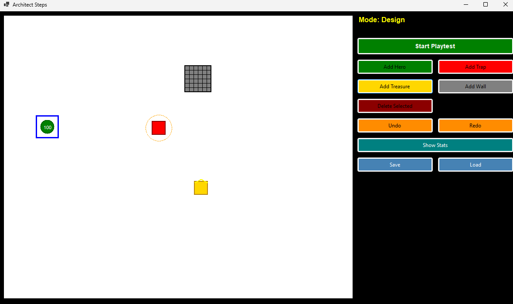

# Dungeon Architect

## Overview

Dungeon Architect is a Windows Forms application for designing and testing dungeon layouts. Create intricate dungeons populated with heroes, traps, treasure chests, and walls. The application features a visual canvas editor with playtest mode to validate your dungeon designs.



## Features

- **Dungeon Editor**: Visual canvas-based dungeon design with drag-and-drop element placement
- **Element Types**: Create heroes, traps, treasure chests, and walls with customizable properties
- **Playtest Mode**: Switch between edit and playtest modes to test your dungeon in real-time
- **Undo/Redo**: Full command history management for edit operations
- **Element Editing**: Dedicated forms to edit properties of each element type
- **Statistics Panel**: View dungeon statistics and element information
- **File Storage**: Save and load dungeon configurations in JSON format

## Tech Stack

- **Language**: C# 12
- **Framework**: .NET 8.0
- **UI Framework**: Windows Forms
- **Architecture**: MVVM-inspired with Command pattern for undo/redo
- **Dependencies**: System.Drawing.Common

## Requirements

- Windows OS (Windows 7 or later)
- .NET 8.0 Runtime or SDK
- Visual Studio 2022 or compatible IDE (optional)

## Installation

### Prerequisites
- Install [.NET 8.0 SDK](https://dotnet.microsoft.com/download/dotnet/8.0)

### Steps

1. Clone or download the repository
2. Navigate to the project directory:
   ```bash
   cd "Dungeon architect"
   ```
3. Restore dependencies:
   ```bash
   dotnet restore
   ```
4. Build the solution:
   ```bash
   dotnet build
   ```
5. Run the application:
   ```bash
   dotnet run --project DungeonArchitect.csproj
   ```

## Configuration

### Project Structure

```
DungeonArchitect/
├── DungeonArchitect.csproj        # Main application project
├── DungeonArchitect.sln           # Solution file
├── Program.cs                     # Application entry point
├── DungeonRenderer.cs             # Rendering logic
├── Forms/                         # Windows Forms UI
│   ├── MainForm.cs                # Main editor window
│   ├── StatsForm.cs               # Statistics display
│   ├── TrapEditorForm.cs          # Trap properties editor
│   ├── TreasureEditorForm.cs      # Treasure chest editor
│   ├── WallEditorForm.cs          # Wall properties editor
│   └── TrapEditorForm.cs          # Trap editor
├── ArchitectDungeon.Core/         # Core logic library
│   ├── Commands/                  # Undo/redo command implementations
│   ├── Core/
│   │   └── DungeonScene.cs        # Main dungeon data model
│   └── Models/                    # Data models (Hero, Trap, etc.)
└── bin/                           # Build output
```

### Building from Source

- **Debug Build**: `dotnet build`
- **Release Build**: `dotnet build -c Release`
- **Clean**: `dotnet clean`

### Dungeon File Format

Dungeon configurations are stored in JSON format with element positions, types, and properties. Use the application's save/load features to manage dungeon files.
